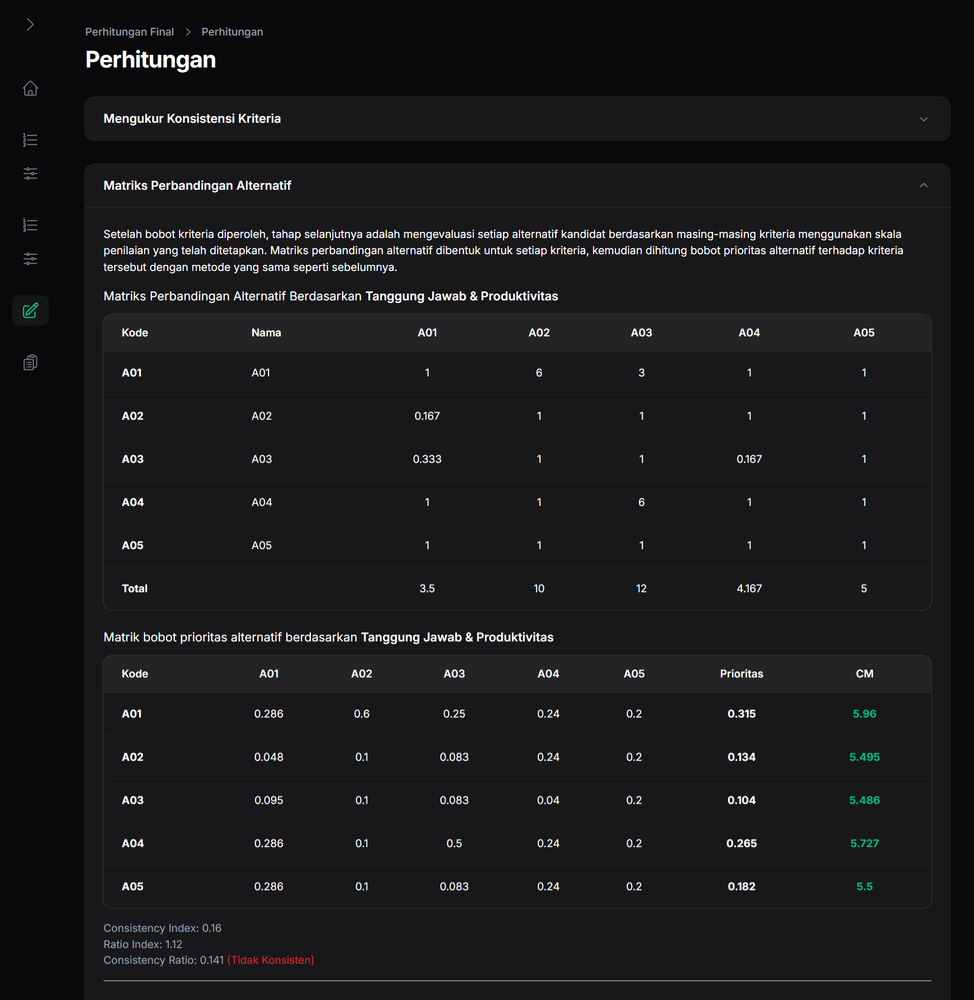
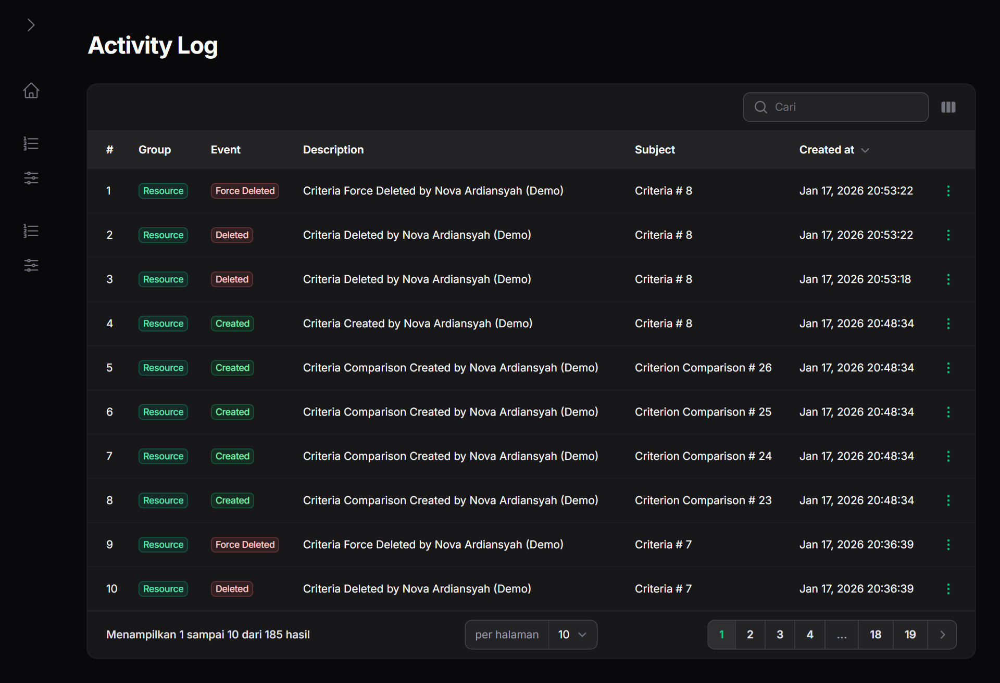

# Talent Rank - Decision Support System (DSS)

Hi Future Developer,

Welcome to **Talent Rank**! This project is a decision support system designed to select the best employees using the **Analytical Hierarchy Process (AHP)** method. Built with the latest technologies, it provides a robust and efficient way to rank talent based on multiple criteria.

This system is divided into two primary roles:
- **Manager:** Responsible for managing criteria, weights, and final evaluations.
- **Employee:** Participants in the evaluation process.

## Dazzling Tech Stack

- [Laravel 12](https://laravel.com/) - Backend PHP Framework
- [Filament PHP](https://filamentphp.com/) - TALL Stack Admin Panel
- [PHP 8.3](https://www.php.net/) - Server-side language
- [PostgreSQL](https://www.postgresql.org/) - Database Management
- [Tailwind CSS](https://tailwindcss.com/) - CSS Framework

## Demo Version
You can explore the system on our demo site: [https://talent-rank-ahp.novaardiansyah.id](https://talent-rank-ahp.novaardiansyah.id)

**Credentials:**
- Email: `demo@novaardiansyah.id`
- Password: `3iDKLKqizxCewC2C`

> Note: Some features may be limited in the demo version. If you encounter any bugs or issues, please feel free to open an issue.

## Project Previews

## Credentials & Environment

While this repository is public, please note that all forms of credentials, API keys (including `.env`), and environment configurations are **not provided**. Access to the production database and sensitive configuration remains restricted for security reasons.

If you are interested in using this project for specific purposes or require a demo environment setup guide, please contact me directly.

## Let's Connect

Need to chat? Feel free to drop me a line via [Email](mailto:novaardiansyah78@gmail.com) or hit me up on [WhatsApp](https://wa.me/6289506668480?text=Hi%20Nova,%20I%20have%20a%20question%20about%20your%20project%20Talent%20Rank%20AHP). I'm just a message away!

## Project Status

## Code of Conduct

We believe in fostering a welcoming and inclusive environment for everyone. Please be respectful, considerate, and constructive in all interactions. By participating in this project, you agree to uphold our Code of Conduct. Let's collaborate and make this community awesome together!

## Licensing Groove

This project is licensed under the [MIT License](LICENSE).

Feel free to use, modify, and share it with the world. Just remember to keep the original license intact. Let's spread the joy of coding together!

---

**Happy coding and collaborating!**

— Nova Ardiansyah
